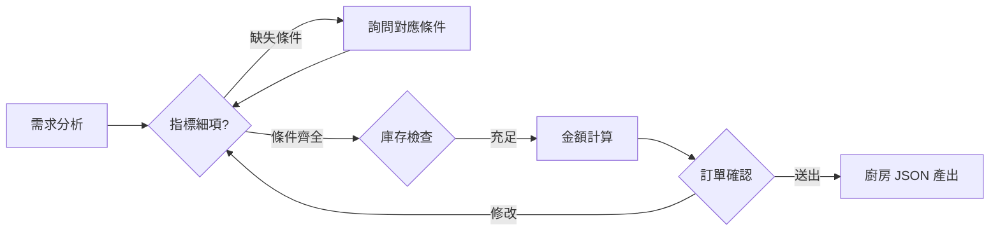

# 🔄 訂飲料工作流 (Beverage Order Workflow)

本工作流定義了 Agent 接到點餐指令後的操作邏輯步序。

## 📍 流程定義 (Step by Step)

### 1. 需求分析 (Input Analysis)
*   **動作**：解析用戶輸入。
*   **分支**：若細節不足，立即反向詢問。

### 2. 資料對應與庫存檢查 (Stock Check)
*   **動作**：調用 **`stock_sync`** 與溫度邏輯。

### 3. 金額計算 (Calculation)
*   **動作**：調用 **`calculate_order`**。

### 4. 最終確認與傳送 (Final Confirmation)
*   **動作**：產出 JSON 給予廚房。

---

## 📈 流程圖 (Mermaid)

