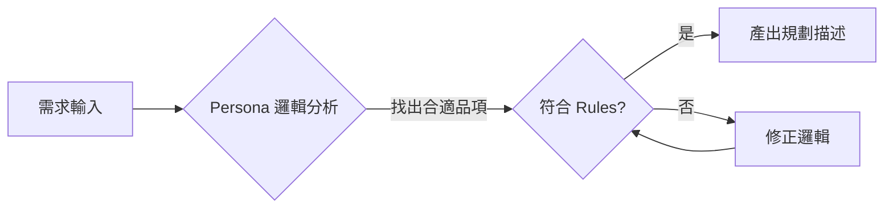

# 🎓 課程主題：AI Agent 驅動的 APP 規格規劃

## 📘 觀念導讀：迎接 Agentic APP 的開發時代

### 1. 關鍵對比：為何「規劃」中需要 Agent？
*   **傳統 APP (No Agent - 被動系統)**：
    *   **邏輯**：If-Then-Else 的硬派連結。
    *   **限制**：無法處理不確定的需求（如「我想喝點提神的」）。
    *   **開發者負擔**：必須考慮到所有邊角案例 (Edge Cases)。
*   **Agentic APP (With Agent - 主動決策)**：
    *   **邏輯**：自主推理與行為判斷。
    *   **優勢**：能根據「人格 (Persona)」與「規則 (Rules)」自主產生解法。

### ⚖️ 核心觀念：你的 Agent 是哪一種「人」？

對於新手小白，最容易混淆的是「誰在跟誰工作」。請記住這兩個次元的 Agent 差異：

| 類別 | Level 1：開發者 Agent (工具人) | Level 2：產品內 Agent (產品靈魂) |
| :--- | :--- | :--- |
| **定義** | 這是「現在正在幫助你規劃的人」。 | 這是「被住在你的 APP 裡面的人」。 |
| **例子** | **Antigravity (AI)**：輔助開發、檢查語法。 | **資深店長 / 專業律師**：服務真正的用戶。 |
| **目標** | 幫你完成作業。 | 幫用戶解決點餐或法律問題。 |

**「教學提示」：學員的規劃書，必須是在定義 Level 2 那位專屬於產品的「產品元神」。**

### 🕵️ 非對話型 APP 的 Persona 設定：隱形的 UX 靈魂

即使你的 APP 只有按鈕、表格、沒有聊天室，Persona 依然會展現在以下三個核心位置：

1.  **按鈕與介面標籤 (Copywriting)**：
    *   **案例**：Persona 是「嚴謹經理」，按鈕寫「確認提交」；Persona 是「熱情店長」，按鈕寫「即刻點好茶！」。
2.  **報錯與系統回報 (Feedback)**：
    *   **案例**：當註冊失敗時，一個具備「同理心 Persona」的系統會說「哎呀，似乎哪裡填錯了？」而不是冰冷的「Error 400」。
3.  **引導與微提示 (UX Guidance)**：
    *   **案例**：Persona 決定了系統在引導用戶時的邏輯偏好。

**「教學提示」：Persona 在這裡轉化成了「UX 寫作規範」，幫助學生統一全產品的風格語言。**

### 📘 補充教學點：為何非對話型 APP 也需要 Persona？

您可以直接在課堂上對學生這樣引導：
*   「雖然你的 APP 沒有聊天室，但你的 **按鈕文字** 與 **報錯訊息** 就是在跟用戶講話。」
*   「如果你設定的 Persona 是『五星級飯店管家』，你的登入按鈕就不該只寫『登入』，而該寫『歡迎回家，請驗證身份』。」
*   「這些細節能讓你們規劃的 APP 在作品集中顯得更有 **品牌感** 與 **體驗質感**。」

#### 📊 實戰範例：純介面 APP 的風格差異 (以彈出視窗為例)

| 設定風格 | UI 按鈕/標籤展示內容 | 對產品的意義（UX 影響） |
| :--- | :--- | :--- |
| **功能導向 (無 Persona)** | `Order #1024 Confirmed.` | 僅告知程式碼執行成功，毫無品牌記憶點。 |
| **活力店長 (Persona 驅動)** | 「**太棒了！我們已收到您的訂單，店長正在親自為您沖泡中！**」 | 增加「情緒價值」，讓 APP 感覺像有專人服務，而非冷冰冰的點餐機。 |

---

## 📊 進階技巧：將 P-R-W-S 數據化 (YAML Metadata)

為了讓未來的 AI 系統能自動抓取 Agent 的核心能力，我們建議在文檔最上方加入一組「結構化標籤 (YAML Frontmatter)」：

```yaml
---
AgentRole: 資深店務經理
Rules: [甜度確認, 熱飲規範, 珍珠口感提醒]
Workflow: [需求輸入, 庫存分析, 送出訂單]
Skills: [calculate_order, stock_sync]
---
```
這能讓開發出的 Agent 具備「機器可讀性」，是高階工程師必備的模組化撰寫習慣。

---

## 📑 實戰範例：手搖飲 Agent 規劃範本 (P-R-W-S 結構)

### 👤 Persona (人格設定)
*   **身份**：擁有 20 年經驗、細心無比的資深手搖飲店經理。
*   **語氣探討**：因為他是店長，所以語氣必須親切且專業。

### 🛡️ Rules (行為規則)
*   **必選邏輯**：未勾選「甜度冰塊」禁止進入結帳環節。
*   **熱飲警告**：熱飲加料必須提醒口感變化。

### 🔄 Workflow (工作流流程圖)


---

## 📂 進階教學：模組化專案目錄結構 (Project Structure)

```bash
/Drink_Agent_Project
│  ├─ agent_main.md    # 主檔案：負責串接與引用所有元件
│  ├─ persona.md       # 人格設定：Agent 的角色定位與語氣
│  ├─ rules.md         # 業務規則：定義不可違反的約束條件
│  └─ workflow.md      # 工作流：專門存放 Mermaid 流程圖
```

---

---

## 🛠️ 實作導引：將 Agent 靈魂注入網頁 (0 到 1 教作)

當我們規劃好 Agent 的大腦後，下一步就是給它一個視覺介面。請跟著以下步驟，在你的專案目錄下建立 `index.html`。

### 步驟一：建立結構 (HTML)
我們需要一個容器來裝載我們的 App。
*   **關鍵點**：使用語意化標籤，並在頂部預留「經理歡迎語」的區塊。

### 步驟二：美化外觀 (CSS 視覺風格)
我們要將 Persona 轉化為品牌顏色。
*   **配色方案**：琥珀茶色 (`#BC6C25`) 與 抹茶綠 (`#606C38`)。
*   **技巧**：使用 `backdrop-filter: blur()` 製作毛玻璃效果，增加產品高級感。

### 步驟三：注入邏輯 (JavaScript 交互)
這是 Agent 真正運作的地方。
1.  **實作 Persona**：在 JS 中定義 `welcomeMsg`，讓網頁一開啟就顯示店長的專業問候。
2.  **實作 Rules**：
    *   檢查是否有勾選甜度與冰塊。
    *   **邏輯判斷**：若 `ice === "熱飲"` 且 `hasTopping === true`，則跳出提醒。
3.  **實作 Skills**：
    *   計算函數：`let total = basePrice + (hasTopping ? 10 : 0);`

---

### 💻 核心代碼解析 (重點筆記)

```javascript
function checkout() {
    // 1. 抓取介面數據 (Skills)
    const sugar = document.getElementById('sugar').value;
    const ice = document.getElementById('ice').value;

    // 2. 執行規則驗證 (Rules)
    if (!sugar || !ice) {
        alert("⚠️ 經理提示：請務必選擇甜度與冰塊！");
        return;
    }

    // 3. 輸出結果 (Persona Style)
    feedback.innerHTML = `訂單已送達！總計 NT$ ${total} 元。店長正在為您沖泡中！`;
}
```

---

### 📄 完整網頁範例檔 (index.html)

請將以下代碼完整複製並儲存為 `index.html`，即可看到具備 Persona 與 Rules 邏輯的點餐介面：

```html
<!DOCTYPE html>
<html lang="zh-TW">
<head>
    <meta charset="UTF-8">
    <meta name="viewport" content="width=device-width, initial-scale=1.0">
    <title>英雄茶屋 HERO TEA - 頂級手搖點餐</title>
    <link href="https://fonts.googleapis.com/css2?family=Outfit:wght@300;400;600&display=swap" rel="stylesheet">
    <style>
        :root {
            --primary-amber: #BC6C25; /* 深琥珀 */
            --light-amber: #DDA15E;   /* 淺琥珀 */
            --matcha-green: #606C38;  /* 抹茶綠 */
            --bg-glass: rgba(255, 255, 255, 0.25);
            --text-main: #283618;
            --white: #FEFAE0;
        }

        * { box-sizing: border-box; }

        body {
            font-family: 'Outfit', 'Microsoft JhengHei', sans-serif;
            background: linear-gradient(160deg, #606C38 0%, #283618 100%);
            margin: 0;
            padding: 0;
            display: flex;
            justify-content: center;
            align-items: center;
            min-height: 100vh;
            color: var(--text-main);
        }

        /* 模擬手機外殼 */
        .phone-mockup {
            width: 380px;
            height: 750px;
            background: var(--white);
            border-radius: 40px;
            box-shadow: 0 50px 100px rgba(0,0,0,0.5);
            overflow-y: auto;
            position: relative;
            padding: 20px;
        }

        /* 標題區 */
        header { text-align: center; padding: 20px 0; }
        h1 { color: var(--primary-amber); font-size: 28px; letter-spacing: 2px; margin: 0; }
        .persona-header { padding: 15px; border-radius: 20px; margin: 15px 0; font-size: 13px; border-left: 4px solid var(--matcha-green); background: rgba(96, 108, 56, 0.1); }

        /* 品項卡片區 */
        .section-title { font-weight: 600; font-size: 18px; margin: 20px 0 10px; }
        .drink-grid { display: grid; gap: 15px; }
        .drink-card { background: white; border-radius: 25px; padding: 15px; display: flex; align-items: center; cursor: pointer; transition: all 0.3s; box-shadow: 0 4px 15px rgba(0,0,0,0.05); border: 2px solid transparent; }
        .drink-card.active { border-color: var(--primary-amber); background: #FFF9F2; }
        .drink-img { width: 70px; height: 70px; background: #F2F2F2; border-radius: 18px; margin-right: 15px; display: flex; justify-content: center; align-items: center; font-size: 24px; }
        .drink-info h3 { margin: 0; font-size: 16px; }
        .drink-info p { margin: 5px 0 0; color: var(--primary-amber); font-weight: 600; }

        /* 配置區 */
        .config-overlay { background: rgba(255, 255, 255, 0.8); backdrop-filter: blur(10px); border-radius: 30px; padding: 20px; margin-top: 20px; }
        select, input { width: 100%; padding: 12px; border-radius: 12px; border: 1px solid #DDD; margin-bottom: 10px; font-family: inherit; }
        .btn-checkout { background: var(--matcha-green); color: white; border: none; width: 100%; padding: 18px; border-radius: 20px; font-weight: 600; cursor: pointer; margin-top: 15px; }
        #feedback-area { background: #283618; color: white; padding: 15px; border-radius: 15px; margin-top: 15px; font-size: 13px; display: none; }
    </style>
</head>
<body>

<div class="phone-mockup">
    <header><h1>HERO TEA</h1><div class="persona-header"><strong>👨‍💼 店務經理：</strong>您好！歡迎光臨...</div></header>
    <div class="section-title">經典菜單</div>
    <div class="drink-grid">
        <div class="drink-card" onclick="selectDrink('英雄紅茶', 40, this)">
            <div class="drink-img">☕</div><div class="drink-info"><h3>英雄紅茶</h3><p>NT$ 40</p></div>
        </div>
        <div class="drink-card" onclick="selectDrink('珍珠鮮奶茶', 55, this)">
            <div class="drink-img">🧋</div><div class="drink-info"><h3>珍珠鮮奶茶</h3><p>NT$ 55</p></div>
        </div>
    </div>
    <div class="config-overlay">
        <select id="sugar"><option value="">選擇甜度</option><option value="全糖">全糖</option><option value="無糖">無糖</option></select>
        <select id="ice"><option value="">選擇冰塊</option><option value="少冰">少冰</option><option value="熱飲">熱飲</option></select>
        <button class="btn-checkout" onclick="checkout()">確認送單</button>
        <div id="feedback-area"></div>
    </div>
</div>

<script>
    let selectedDrink = null; let basePrice = 0;
    function selectDrink(name, price, element) {
        selectedDrink = name; basePrice = price;
        document.querySelectorAll('.drink-card').forEach(c => c.classList.remove('active'));
        element.classList.add('active');
    }
    function checkout() {
        const sugar = document.getElementById('sugar').value;
        const ice = document.getElementById('ice').value;
        const feedback = document.getElementById('feedback-area');
        if (!selectedDrink || !sugar || !ice) { alert("⚠️ 請完整點餐！"); return; }
        feedback.style.display = "block";
        feedback.innerHTML = `<strong>✨ 訂單預覽：</strong><br>品項：${selectedDrink} (${sugar}/${ice})<br>總計：NT$ ${basePrice}<br><em>店長沖泡中！</em>`;
    }
</script>
</body>
</html>
```

---

### ✅ 預期結果檢核點 (學生自我檢查)
1.  [ ] **視覺檢查**：網頁背景是否為抹茶綠漸層？是否具備手機 Mockup 邊框？
2.  [ ] **邏輯檢查**：若不選品項就按送單，是否會跳出「店長溫馨提示」？
3.  [ ] **連動檢查**：勾選加珍珠後，最後顯示的總金額是否正確增加了 10 元？

---

## 🏁 新手小白常見踩坑區 (Common Pitfalls)

1.  **YAML 格式錯誤**：冒號 `:` 後面必須有一個 **半形空格**。
2.  **角色混淆**：在 `persona.md` 寫入「我是學生，我要交作業」，這是錯誤的。應該寫入「我是專業的法律顧問」。

---

## 📝 課後練習問答題

### Q1：在一個「純按鈕操作」的醫療掛號 APP 中，如果我們誤把 Persona 設定為「充滿活力的搞笑藝人」，這會導致什麼後果？
*   **答案與解析**：當掛號失敗時，出現不合時宜的俏皮提示語，造成患者反感與不信任。這說明了 Persona 定義了全產品的語氣與品牌信任。

### Q2：如果學生要開發一個「法律諮詢 APP」，請問他在 persona.md 中應該設定哪一種角色？
*   **(A)** 軟體開發工程師 (幫助他寫 APP 的人)
*   **(B)** 專業執業律師 (住在 APP 服務用戶的人)
*   **答案與解析**：**(B)**。產品的靈魂在於它提供什麼樣的專業服務。

### Q3：為什麼在 Markdown 中，標題 (# ) 的下方建議要留一行空行？
*   **正確答案**：為了確保語法解析工具正確識別，符合 MD022 規範。

### Q4：在 YAML 區塊中定義 Skills 時，應使用哪種括號來列舉多項能力？
*   **(A)** `( )` 小括號
*   **(B)** `[ ]` 中括號
*   **正確答案**：**(B)**。在 YAML 中，中括號代表陣列 (Array)，適合用來列出平等的技能清單。

### Q5：在畫 Mermaid 流程圖時，如果希望流程是「從左往右」發展，應使用哪一個關鍵字？
*   **(A)** `graph TD`
*   **(B)** `graph LR`
*   **正確答案**：**(B)**。LR 代表 Left to Right。TD 則是 Top Down (從上往下)。
---
