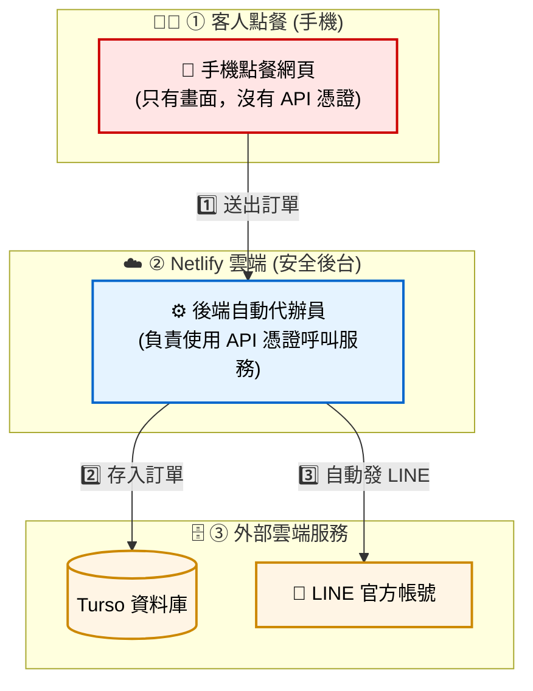

# CH08 · 天下茶屋：網頁的 App 化部署（PWA 與全自動 Serverless 架構）

本章將「天下茶屋」智慧點餐網頁，升級為可安裝在手機桌面的 App，並透過 Netlify 雲端自動完成「存訂單 + 發 LINE」，全程無需人工介入。

---

### 🗺️ 本章學習路線圖

| Part | 做什麼 | 完成後你能看到什麼 |
| :-: | :--- | :--- |
| 0 | 看懂整體架構圖 | 理解整套系統怎麼運作 |
| 1 | 用電腦模擬手機畫面 | 不用拿手機也能測試 |
| 2 | 建立 App 設定檔 (manifest) | 手機安裝時有正確的名稱與圖示 |
| 3 | 把網頁部署到雲端 | 取得公開的 HTTPS 網址 |
| 4 | 手機安裝 App | 手機桌面出現「天下茶屋」圖示 |
| 5 | 建立後端自動代辦員 | API 憑證安全藏在雲端後台 |
| 6 | 終極驗收 | 手機點餐 → 資料庫 + LINE 同時收到！ |
| 補充 A | 打包上架 App Store（進階） | 了解 PWABuilder 與上架流程 |
| 補充 B | 上架前資安檢查清單 | 確認部署安全無遺漏 |

---

# Part 0 · 整體架構導覽（全自動資料流）

本章採用「**安全代辦員**」的設計。動手之前，請先看以下這張**全景圖**——它能幫您理解客人的訂單，是如何安全、自動地跑到資料庫與您的 LINE 裡面的。

### 🗺️ 全景架構圖



### 📊 每個區塊的角色對照表

| # | 區塊名稱 | 屬於手機 App？ | 屬於後台？ | API 憑證存在哪裡 |
| :-: | :--- | :---: | :---: | :--- |
| **①** | 📱 手機點餐網頁 | ✅ 客人「安裝」的部分 | ❌ | **完全沒有 API 憑證** |
| **②** | ⚙️ 後端自動代辦員 | ❌ | ✅ | Netlify Dashboard 後台 |
| **③** | 🗄️ Turso 資料庫 | ❌ | ❌ 被後台寫入的地方 | — |
| **③** | 💬 LINE 官方帳號 | ❌ | ❌ 被後台呼叫的地方 | — |

> 📌 **「API 憑證」是什麼？**
> 這裡說的「API 憑證」**不是會員的登入密碼**，而是你申請第三方服務時取得的 **Token（令牌）** 或 **Key（金鑰）**——例如 Turso 給你的資料庫 Token、LINE 給你的 Channel Access Token。這些憑證讓程式能以你的身份呼叫服務，一旦外洩，別人就能冒充你存取你的資料庫或 LINE 帳號，所以必須嚴格保管。

### 🚦 三句話總結（給學生）

> 1. **手機**只裝網頁畫面，裡面**永遠沒有任何 API 憑證**。
> 2. **凡是需要用 API 憑證呼叫服務**，全部交給 **Netlify 後台代辦員**處理。
> 3. **絕不把 API 憑證寫在程式碼中**。

---

# Part 1 · 電腦端：使用 Chrome 模擬手機

在開發階段，我們不需要一直拿著真實的手機測試。Google Chrome 瀏覽器內建了強大的「裝置模擬器」。

### 步驟：
1. **開啟網頁**：在電腦瀏覽器中打開你的天下茶屋 `index.html`。
2. **開啟開發者工具**：按下鍵盤 `F12`（或按右鍵選擇「檢查」）。
3. **切換裝置模式**：點擊開發者工具左上角的 **「切換裝置工具列」** 圖示（或按 `Ctrl + Shift + M`）。
4. **選擇手機型號**：在畫面上方的下拉選單中，選擇你想模擬的手機（例如：`iPhone 12 Pro` 或 `Pixel 7`）。
5. **重新載入頁面**：按下 `F5` 重新整理，即可看到手機畫面。

> 💡 **這有什麼好處？** 開發者可以在電腦上立刻看到網頁在不同手機尺寸上的樣子，完全不需要安裝任何手機 App。

---

# Part 2 · 強化前端：建立 App 設定檔（manifest.json）

在把網頁部署到網路上之前，我們先把它「打扮」成一個真正的 App——設定好名稱、圖示與主題色。這個設定檔叫做 **manifest.json**。

> 💡 **本章所有程式碼都由 AI 幫你生成**——因為每位同學的專案結構可能略有差異，由 AI 依照你的專案實際情況生成才會正確。**不要直接複製老師的程式碼。**

### 步驟 0：請 AI 生成 App 圖示

打開 Antigravity，對 AI 下這段 prompt：

> 「請在我的 `app/` 資料夾建立兩個檔案：
>
> **① `icon.svg`**：設計一個 192×192 的天下茶屋品牌圖示，風格簡約，以茶杯為主視覺，使用品牌綠色（`#6a9e60`）為主色、白色為背景。
>
> **② `make-icon.html`**：一個輔助轉檔頁面，內容如下：
> - 用 `` 載入 `icon.svg`
> - 用 JavaScript 將圖片繪製到 192×192 的 `<canvas>`
> - 頁面上有一個「⬇️ 下載 icon.png」按鈕，點擊後自動下載 `icon.png`」

完成後，用瀏覽器開啟 `make-icon.html`，點擊按鈕下載 `icon.png`，確認 `icon.png` 已出現在 `app/` 資料夾後，即可刪除 `make-icon.html`。

**✅ 驗證重點**：`app/icon.png` 存在，用圖片預覽確認是 192×192 的茶杯圖示。

### 步驟 1：請 AI 建立 `manifest.json`

打開 Antigravity，對 AI 下這段 prompt：

> 「請先讀取我專案 `app/css/styles.css` 中的品牌主色（`--green`），然後在我的 `app/` 資料夾（或前端根目錄）建立 `manifest.json`，符合 Web App Manifest 標準。設定如下：
> - `name` 與 `short_name` 都填「天下茶屋」
> - `start_url` 為 `"."`
> - `display` 為 `"standalone"`（隱藏瀏覽器網址列）
> - `background_color`：白色 `#ffffff`
> - `theme_color`：從 CSS 讀取到的品牌綠色（約為 `#6a9e60`）
> - `icons`：包含一個 192x192 的 PNG，`src` 為 `icon.png`，`type` 為 `image/png`」

**✅ 驗證重點**：AI 生成的 JSON 應包含上述所有欄位，特別是：
- `display` 必須為 `"standalone"`
- `icons` 陣列中每個物件應有 `src`、`sizes`、`type` 三個欄位
- `theme_color` 應為綠色系（非藍色）

### 步驟 2：請 AI 把 manifest 連結到主網頁

> 「請在我的主網頁（例如 `index.html`）的 `<head>` 區段加入一行 `<link>` 標籤，引用剛建立的 `manifest.json`。」

**✅ 驗證重點**：
1. 檢查你的 `index.html` 的 `<head>` 區段，應該會多出這一行程式碼：
   ```html
   <link rel="manifest" href="manifest.json">
   ```
2. 開啟瀏覽器 DevTools → **Application** 分頁 → **Manifest** 子項，應能讀到「天下茶屋」名稱與顏色設定。

---

# Part 3 · 第一次上雲：把網頁部署到公開網址

為使手機能存取網頁，需將檔案部署至公開的 HTTPS 網址。本節採用 **Netlify Drop** 拖曳式部署，免費且免安裝。

### 步驟：
1. 打開瀏覽器，前往 [Netlify Drop](https://app.netlify.com/drop)（免註冊）。
2. 將你電腦裡的 `app` 資料夾（含 `index.html`、`manifest.json` 等檔案），**直接用滑鼠拖曳**到網頁中央的虛線圓圈內。
3. 等待約 3 秒鐘，Netlify 會自動生成一組公開網址（例如 `https://happy-tea-xxxx.netlify.app`）。
4. 請把這個網址複製記下來，下一步會用到！

> ⚠️ **【暫時不要對外公開這個網址】**
> 目前網頁還沒有連接資料庫，是純前端展示。
> **Part 5** 會教你建立後端並把 API 憑證安全藏好——完成之前，這個網址先自己測試就好。

---

# Part 4 · 手機體驗：加入主畫面（安裝成 App）

無須通過 Google Play 或 App Store 上架，即可將網頁以接近 App 的形式安裝在手機桌面上。

### 步驟：
1. **用手機開啟網址**：在真實手機上，打開瀏覽器，輸入剛才 Part 3 取得的 Netlify 網址。
2. **加入主畫面**：
   - **🍎 iPhone (Safari)**：點擊瀏覽器正下方的 **「分享」圖示**（往上的箭頭），往下滑找到 **「加入主畫面」**。
   - **🤖 Android (Chrome)**：點擊右上角的 **「三個點」選單**，選擇 **「加到主畫面」**。
3. **確認新增**：自訂名稱為「天下茶屋」，點擊「新增」。
4. **驗證**：回到手機桌面，點開剛才新增的圖示，**瀏覽器網址列應該會消失**，呈現全螢幕介面。

> 🎉 **恭喜！** 你的手機桌面上現在有一個「天下茶屋」App 了！不過它現在還只是純畫面，接下來的 Part 5 會讓它真的能把訂單寫進資料庫並發 LINE 通知。

---

# Part 5 · 後端建置：讓 Netlify 自動幫你處理訂單

這是本章最關鍵的一步——**把 API 憑證安全藏好，並建立雲端自動代辦員**。完成這一步，網頁才算真正安全，也才能對外公開分享。

### 🔄 從 MCP 到 Serverless Function——架構上發生了什麼？

在 ch06／ch07，LINE 通知和資料庫寫入是這樣完成的：

```
手機下單 → localStorage 暫存 → 學校電腦上的 Antigravity AI
                                        ↓
                              MCP LINE server → LINE API
                              MCP DB server   → Turso API
```

**MCP 工具只能跑在安裝了 Antigravity 的那台電腦上**，無法隨著網頁一起部署到雲端。所以 ch07 的 LINE 通知和 DB 寫入，實際上是學校電腦上的 AI 代勞完成的，客人手機本身什麼都沒做。

ch08 要解決的問題就是：**把這份工作從學校電腦搬到雲端**。

```
ch07  MCP LINE server  →  ch08  Netlify Function 直接呼叫 LINE REST API
ch07  MCP DB server    →  ch08  Netlify Function 直接呼叫 Turso HTTP API
```

LINE 和 Turso 本身都有公開的 REST API，MCP 只是 AI 助理呼叫它們的介面。`place-order.js` 做的事情和 MCP 完全相同，只是改用標準 HTTP 呼叫，讓**雲端伺服器 24 小時全自動執行**，不再需要學校電腦開著。

> 💡 **AI 怎麼知道怎麼轉？**
> 因為 LINE、Turso 都是有完整公開文件的主流服務，AI 訓練時就看過它們的 API 用法。Step 1 的 prompt 會請 AI 先讀取 `.env`，讓 AI 認出你用的是哪些服務、憑證叫什麼名字，它就能直接寫出對應的程式碼。**這也是為什麼選用主流服務很重要**——冷門或私有 API 沒有公開文件，AI 就無法自動完成轉換。

### 🔒 API 憑證應該放在哪裡？

以下 **4 個服務憑證**，**絕對不能**寫在手機網頁的程式碼中：

| 環境變數名稱 | 類型 | 說明 |
| :--- | :---: | :--- |
| `TURSO_DB_URL` | URL | Turso 資料庫連線網址 |
| `TURSO_DB_TOKEN` | **Token（存取金鑰）** | 讓程式有權讀寫你的 Turso 資料庫 |
| `LINE_CHANNEL_ACCESS_TOKEN` | **Token（存取金鑰）** | 讓程式有權以你的 LINE Bot 身份發訊息 |
| `DESTINATION_USER_ID` | ID | 要收訂單通知的 LINE 使用者 ID |

> 🔒 **安全守則**：統一把這 4 個服務憑證設定在 **Netlify Dashboard（環境變數）** 裡，交由 **Netlify 雲端後台代辦員**來安全地讀取與使用。

### 💡 解決方案：請 Netlify 雲端當你的「自動代辦員」

客人按下結帳後：
1. 手機只負責**把訂單明細丟給 Netlify**（不帶任何 API 憑證）。
2. Netlify 拿到訂單後，在雲端用你的 API 憑證，**自動存進資料庫**，並**自動發 LINE 給你**。

```text
✅ 全自動安全架構
[客人手機] --(只傳送訂單內容，不帶憑證)--> [Netlify 雲端代辦員]
                                                │
                                    (使用後台設定好的 API 憑證)
                                                ├──> [寫入 Turso 資料庫]
                                                └──> [發送 LINE 通知]

   ↑ 全程 1–2 秒，客人只負責點餐，剩下的麻煩事都交給雲端！
```

### ⚙️ 實作步驟

**Step 1：請 AI 建立後端程式（含 LINE 自動推播）**

> 📌 **`place-order.js` 是什麼？你的電腦現在有嗎？**
> 這是一個即將由 AI 幫你生成的新檔案，你的電腦**現在還沒有**。它是一個跑在 Netlify 雲端的 Node.js 程式（Serverless Function），負責接收手機送來的訂單、寫入 Turso 資料庫、並發送 LINE 通知。完成 Step 3 部署後，它就會跑在 Netlify 的伺服器上，不在你的電腦裡。

先確認你的專案有以下目錄結構（如果還沒有 `netlify/functions/` 資料夾，請先新增）：

```
你的專案/
├── app/                    ← 原本拖到 Netlify 的前端
│   └── index.html
├── .env                    ← 你的憑證記事本（等等要把內容貼到 Netlify 後台）
└── netlify/
    └── functions/
        └── place-order.js  ← 接下來請 AI 建立這個檔案
```

打開 Antigravity，對 AI 下這段 prompt：

> 「請先讀取我專案中的 `.env` 檔案，了解我使用的環境變數命名方式。接著在 `netlify/functions/place-order.js` 建立一個 Netlify Serverless Function，需求如下：
>
> **接收端**
> - 只接受 POST（其他方法回傳 405 錯誤）
> - 接收 JSON 格式的訂單資料（包含訂單編號、品項、數量、金額）
>
> **寫入 Turso 資料庫**
> - 從 `process.env` 讀取資料庫連線資訊
> - 將訂單寫入 `orders` 資料表
>
> **發送 LINE 推播通知**
> - 從 `process.env` 讀取 LINE Token 與 User ID
> - 呼叫 LINE Messaging API 發送訊息，格式：『【天下茶屋新訂單】品項 x 數量，共 NT$ 金額』
>
> **回傳**
> - 成功：HTTP 200，回傳 `{ ok: true }`
> - 失敗：HTTP 500，回傳 `{ ok: false, error: 錯誤訊息 }`
>
> **安全約束**
> - 程式內**絕對不能**出現任何憑證的字面值（Token、Key、URL 等），所有 API 憑證必須從 `process.env` 取得」

> 📌 **`process.env` 是什麼？值從哪裡來？**
> `process.env` 是 Node.js 的內建物件，不需要 import，程式一啟動就存在。它的值由**執行環境**注入：
> - 在**學校電腦**開發時 → 來自 `.env` 檔案
> - 在 **Netlify 雲端**執行時 → 來自 Netlify Dashboard 設定的環境變數（Step 4 設定的那 4 個）
>
> 所以程式碼只寫 `process.env.TURSO_DB_TOKEN`，實際的 Token 值永遠存在 Dashboard 裡，兩邊分開，憑證就不會出現在程式碼中。

**✅ 驗證重點**：
- AI 生成的檔案裡，搜尋你的 Turso 網址或 LINE Token，應為 **0 筆**
- 程式中應有「寫入 Turso」與「呼叫 LINE API」兩段邏輯

---

**Step 2：請 AI 重構你的前端結帳程式**

對 AI 下這段 prompt：

> 「請先讀取我專案中負責處理結帳與送出訂單的前端程式碼（例如 `checkout.js` 或類似功能的 js 檔案，請你自行在專案中找到它）。
>
> **原本行為**：它目前可能只是把訂單寫進 `localStorage` 模擬結帳，並沒有真的寫入雲端資料庫。
>
> **請幫我修改這份程式碼**：
> - 將送出訂單的動作，改成使用 `fetch('/.netlify/functions/place-order', { method: 'POST', ... })` 把訂單資料送到我們剛寫好的後端
> - Request body 是 JSON，請包含訂單的必要資訊（請依照我原本程式的邏輯傳遞）
> - 維持原本按鈕的 loading 與完成 UI 動畫
> - 後端回傳成功 → 顯示「已送出，店家已收到通知」
> - 後端回傳失敗 → 顯示錯誤訊息，按鈕復原讓使用者重試
>
> **安全約束**
> - 程式碼內**絕對不能**引入任何 Turso 或 LINE 的 SDK
> - 程式內**絕對不能**出現任何 `TURSO_` 或 `LINE_` 開頭的字串」

**✅ 驗證重點**：
- 搜尋你的結帳 js 檔，`TURSO` 或 `LINE_` 應為 **0 筆**

---

**Step 3：用 GitHub 連動部署到 Netlify**

> ⚠️ Netlify Drop 拖曳法**只能部署靜態網頁**，無法啟用我們的「自動代辦員」後端程式。所以這一步要改用 GitHub 部署，Netlify 才會自動偵測並啟用 `netlify/functions/` 裡的後端。

1. 在 GitHub 建立一個新 repo，把整個專案（含 `app/` 與 `netlify/`）推上去
2. 到 [app.netlify.com](https://app.netlify.com) → **Add new site** → **Import from Git** → 選你的 repo
3. **Build settings**：
   - **Publish directory**：`app`
   - **Functions directory**：`netlify/functions`（通常會自動偵測）
4. 點 **Deploy site**

---

**Step 4：在 Netlify Dashboard 設定 4 個環境變數**

1. 進入剛建立的 Site → **Site settings** → **Environment variables** → **Add a variable**
2. 新增 **4 個** 變數（變數名必須與你的 `.env` 檔案**完全一致**）：
   - `TURSO_DB_URL`：你的 Turso 資料庫網址（`libsql://...`）
   - `TURSO_DB_TOKEN`：你的 Turso 認證 Token
   - `LINE_CHANNEL_ACCESS_TOKEN`：你的 LINE Bot Channel Access Token
   - `DESTINATION_USER_ID`：要收訂單通知的 LINE User ID
3. **Deploys** → **Trigger deploy** → **Deploy site**（重新部署讓設定生效）

> ⚠️ **變數名打錯字** 是這一步最常見的錯誤——建議**直接從 `.env` 複製貼上**變數名，不要手打。

---

# Part 6 · 終極驗收：完整的全自動 OMO 流程測試

後端已建好、API 憑證已設定完畢——現在是最激動人心的時刻！拿出手機，讓整套自動化系統跑起來！

> 📶 **網路需求**：手機連上 4G / 5G / WiFi 均可。

### 步驟一：用手機 App 點一杯飲品

1. 從手機桌面點擊 **「天下茶屋」** App 圖示打開。
2. 選一杯飲品 → 點擊結帳按鈕。
3. 看到「已送出，店家已收到通知」的成功訊息。

### 步驟二：驗收後台與 LINE 通知

依序檢查以下 5 個驗證點：

1. **F12 → Sources → 檢查你的結帳 js 檔**：檔案內**無任何 Turso / LINE 憑證字串（Token、Key）** ✅
2. **F12 → Network**：請求**只**送往 `/.netlify/functions/place-order`，不應有任何直連資料庫或 LINE 的請求 ✅
3. **Turso Dashboard → `orders` 表**：剛送出的訂單已寫入 ✅
4. **手機 LINE**：幾秒內收到「【天下茶屋新訂單】...」推播 ✅
5. **Netlify Dashboard → Functions → place-order**：log 顯示 200 OK ✅

> 🎉 **五個驗證點全綠燈** = 達成「**手機點按鈕 → 自動寫 DB + 自動發 LINE**」全自動 OMO！
> 現在這個網址已完全安全，可以對外公開分享了！

---

> 📌 **補充說明 A · 上架 App Store / Google Play（進階，非必修）**
>
> 完成本章後，你的 PWA 已可透過「加入主畫面」安裝在手機桌面。若未來想進一步上架至應用程式商店，可使用 Microsoft 官方的免費工具 **[PWABuilder](https://www.pwabuilder.com)**——貼上 Netlify 網址即可直接打包 `.apk`（Android）或 Xcode 專案（iOS），無需安裝 Android Studio 或撰寫原生程式碼。
>
> **上架費用提醒**：Google Play Developer 帳號一次性 USD 25；Apple Developer Program 每年 USD 99（且需要 Mac 才能提交 iOS）。
>
> **PWA 已知限制**：iOS Safari 不支援 Web Push 推播通知；首次開啟需要網路連線（本章未涵蓋離線快取設定）。

---

> 📌 **補充說明 B · 上架前資安檢查清單**
>
> - ✅ 4 個服務憑證（Token / Key / URL）全部設定在 **Netlify Dashboard 環境變數**，前端程式碼不得包含任何 `TURSO_` / `LINE_` 字串
> - ✅ DevTools → Sources 檢視結帳 js 檔，**確認無任何 API 憑證殘留**
> - ✅ DevTools → Network 送一筆測試訂單，請求**只**送往 `/.netlify/functions/place-order`
> - ✅ 確認 Netlify 部署網址為 `https://` 開頭
> - ✅ 確認 `manifest.json` 已填妥 App 名稱、圖示、主題色等必填欄位
