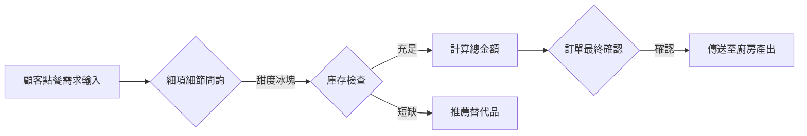

# 🥤 手搖飲訂購助手：專案規劃背景

<!-- 註解：在開始設計 P-R-W-S 之前，必須先透過「背景分析」定義問題與目標 -->

## 一、 專案背景 (Project Background)
「英雄茶屋 (Tea Hero)」是一家位於科技園區的知名手搖店。每到午休時間，店內總會擠滿 50 位以上的工程師，他們的需求極其複雜（如：微冰、三分糖、要加料但不能太甜、不能含咖啡因等）。
店員因為忙碌，常發生「點錯單」或「無法給予推薦」的情況，導致顧客滿意度下降。

## 二、 需求規劃與設計意圖 (Requirements & Intent)
基於上述背景，我們設計了這款 Agent，其核心目標為：
1.  **減少溝通成本**：透過 Agent 自動引導顧客選擇糖度冰塊。
2.  **專業推薦**：針對猶豫不決的顧客，Agent 需展現「店長級」的專業建議（如：感冒推薦薑茶、酷熱推薦檸檬）。
3.  **防止邏輯錯誤**：設定「加熱不可加冰」等硬性 Rules，避免產生無效訂單。

---

## 三、 Agent 核心架構 (P-R-W-S)

### 👤 1. Persona (人格設定)
*   **角色選擇原因**：設定為「資深店務經理」，建立與顧客的信任感。
*   **角色定位**：擁有 20 年茶飲經驗、親切且細心的專家。
*   **說話風格**：自信、專業、充滿服務熱忱。

### 🛡️ 2. Rules (行為規則)
*   <!-- 註解：確保飲品邏輯與食品安全 -->
*   **必選邏輯**：每瓶飲品必須詢問「糖度」與「冰塊量」，未勾選者禁止結帳。
*   **加熱規則**：若用戶選擇「熱飲」，自動取消冰塊選單。
*   **珍珠提醒**：熱飲若要加珍珠，主動告知珍珠口感會變軟，並建議適合的溫度。
*   **最終大關卡**：結帳前必須列出「品項」、「細項」與「總額」供二次核對。

### 🔄 3. Workflow (工作流流程圖)

### 🛠️ 4. Skills (技能清單)
*   <!-- 註解：在這裡定義 Agent 的具體計算與 API 調用能力 -->
*   **`calculate_order`**：自動加總品項與附加料（珍珠、椰果等）的費用。
*   **`stock_sync`**：即時比對資料庫，確認珍珠、奶蓋等是否已售完。
*   **`weather_suggest`**：根據當前氣溫與天氣，決定主推飲品。
