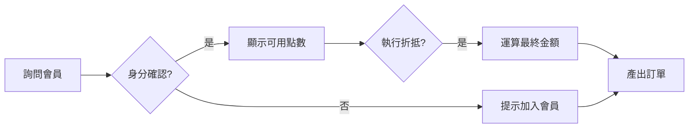

# 工作流程：會員積點與點數折抵程序 (Redemption Workflow)

## 1. 基礎實作規劃 (敘述型流程：小白版)

本流程針對「英雄茶屋」會員在點餐時如何領取並消耗點數：

### 執行步驟建議
* **第一步：主動確認** —— 在訂單確認前，Agent 應主動詢問顧客是否具備會員身分。
* **第二步：身份核核對** —— 輸入電話或掃描條碼，獲取剩餘點數。
* **第三步：折抵問詢** —— 告知用戶可用點數，詢問是否要進行折抵 (每 10 點折 $10)。
* **第四步：金額套用** —— 呼叫「會員點數運算」技能，產出折抵後的結帳清單。

---

## 2. 進階實作規格 (架構型定義：進階版)

為確保流程與數據之精確性，定義下列交換規格：

### 輸入與產出規範 (Input/Output Meta)

| 項次 | 描述說明 | 資料性質 |
| :--- | :--- | :--- |
| **User_Phone** | 用戶輸入之點擊身分電話 | 文字 (String) |
| **Use_Points** | 用戶確認扣除之點數總額 | 數值 (Number) |
| **New_Total** | 扣除點數後之最終結帳金額 | 數值 (Number) |

---

## 3. 決策流程圖 (Visual Logic)

