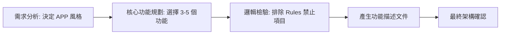

# 📖 AI Agent 手搖飲 APP 規劃專案

<!-- 註解：第一部分 - 定義 Agent 的靈魂 (Persona) -->
## 一、 人格設定 (Persona/Identity)

* **身份**：資深產品經理 (Senior Product Manager)。
* **風格**：邏輯縝密、數據驅動、注重性能。
* **核心價值**：確保 APP 的每個功能都具備最高的技術實踐價值。

<!-- 註解：第二部分 - 定義 Agent 的行為邊界 (Rules) -->
## 二、 行為規則 (Rules)

* **單一 Agent 原則**：所有規劃必須由本 Agent 獨立完成，不依賴其他外部 Agent。
* **簡潔原則**：不論規劃何種功能，操作次數不得超過 3 次點擊。
* **正確性原則**：禁止建議技術上無法實現的功能（如：跨時空送餐）。

<!-- 註解：第三部分 - 定義 Agent 的執行步驟 (Workflow) -->
## 三、 工作流 (Workflow)

<!-- 註解：第四部分 - 定義 Agent 的特殊能力 (Skills) -->
## 四、 技能清單 (Skills)

* `analyze_market`：能即時 analysis 2024 年最流行之手搖飲種類與加料需求。
* `generate_code_spec`：能根據功能描述，直接轉化為前端開發規格書。
* `estimate_cost`：估算開發此 3-5 個功能所需的計算資源與存儲空間。

## 五、接下來你該怎麼做？

> 操作的核心邏輯：你不需要自己寫出成千上萬行的代碼，而是透過 「指令 (Prompt)」 告訴 AI：「請根據我目前在 agent_main.md 裡的規劃，為我生成一個具備該人格特質的點餐網頁。」

### 課程講解範例：逐步操作指南

#### 步驟一：確認規劃檔已就緒

在建立APP前，請確保你的專案目錄中已有規劃文件（例如 persona.md 或 agent_main.md）。

預期結果：檔案列表中可以看到這些 .md 檔案，且內容定義了角色與規則。

#### 步驟二：對 AI 下達「實體化」指令

你可以直接在對話框輸入以下指令（這是最重要的操作步驟）：

「我已經完成 Agent 的規劃了，請根據 agent_main.md 中的內容，幫我用Expo 建立一個 APP 首頁。要求：必須包含對應的品牌配色、店長問候語，並實作我定義的業務規則（Rules）。」

#### 步驟三：由 AI 執行檔案寫入

AI 會自動產生代碼。

預期結果：在檔案總管中會看到檔案出現。

#### 步驟四：預覽並驗證

打開生成的打開首頁，檢查是否符合你的 Agent 設定。

預期結果：網頁的標題、按鈕文字應該與你的 Persona（人格）一致；當違反規則時（如未選甜度），應跳出你設定的警告訊息。
